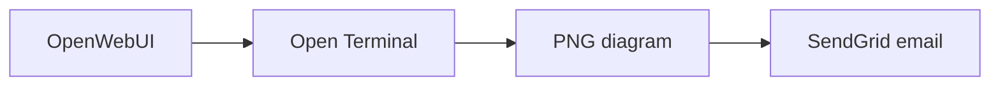

# OpenWebUI SendGrid Notifier

An OpenWebUI workspace Tool and Action Function for sending email notifications
to the current user. The Tool lets an LLM send a message; the Action adds an
envelope button beneath assistant messages for one-click delivery. The destination
is locked to the authenticated OpenWebUI user's account email.

## Features

- Uses OpenWebUI's injected `__user__["email"]` as the only recipient
- Adds an envelope Action beneath assistant messages for exact-message delivery
- Shows a native success, information, or error notification after each Action click
- Supports classic message content and Responses API structured output
- Generates the Action email subject from the first heading or sentence
- Keeps the SendGrid API key in an admin-configured password valve
- Sends multipart plain-text and styled HTML email through SendGrid API v3
- Converts Markdown headings, emphasis, lists, links, code blocks, and tables
- Sanitizes generated HTML with a conservative tag and URL allowlist
- Renders up to three Mermaid code blocks as inline PNG images through Open Terminal
- Optionally attaches one file from the Open Terminal selected for the chat
- Reuses OpenWebUI's system-level Open Terminal URL, credentials, and access grants
- Enforces a 10 MB attachment limit without passing file bytes through the LLM
- Shows in-chat progress and error notifications
- Suppresses repeated sends from the same OpenWebUI message for 24 hours
- Limits each user to one successful notification every 10 minutes by default
- Uses only Python's standard library for HTTP requests
- Masks the destination address in the tool result

## Install the Tool

1. In OpenWebUI, open **Workspace → Tools → Create Tool**.
2. Copy the complete contents of `openwebui_sendgrid_notifier.py` into the editor.
3. Save the tool.
4. Open the tool's **Valves** settings and configure:
   - `SENDGRID_API_KEY`: a SendGrid key with **Mail Send** permission
   - `SENDER_EMAIL`: a sender address verified in SendGrid
   - `SENDER_NAME`: the display name recipients will see
   - `RATE_LIMIT_MINUTES`: minimum delay per user; defaults to `10` and can be
     set to `0` to disable the cooldown
5. Enable the tool for the desired model or select it in a chat.

## Install the message Action

1. In OpenWebUI, open **Admin Panel → Functions → Add Function**.
2. Copy the complete contents of `openwebui_sendgrid_email_action.py` into the
   editor and save it.
3. Open the Function's **Valves** and configure:
   - `SENDGRID_API_KEY`: the same SendGrid key used by the Tool
   - `SENDER_EMAIL`: the same verified SendGrid sender
   - `SENDER_NAME`: the sender display name
   - `RATE_LIMIT_MINUTES`: Action-specific cooldown; defaults to `10`
   - `SUBJECT_PREFIX`: optional text placed before the generated subject
   - `OPEN_TERMINAL_CONNECTION`: leave blank when the user has access to only one
     system Open Terminal; otherwise enter the connection's internal ID from
     **Admin Settings → Integrations → Open Terminal**. The ID is preferred over
     the display name.
   - `priority`: toolbar button order; lower values appear first
4. Enable the Function globally, or attach it to the desired model(s).
5. Click the envelope button beneath an assistant message. The Action emails that
   exact message and leaves the chat message unchanged.

The Tool and Action are separate OpenWebUI plugins, so their valves are stored
separately. Copy the SendGrid values once when installing the Action. The Action
does not ask for a recipient or subject: it uses the signed-in user's email and
derives the subject automatically.

The Action receives the clicked message ID and selects that exact assistant turn,
even when later assistant messages exist. It reads ordinary `content`, rich text
content arrays, and Responses API `output_text` blocks. Non-text parts and hidden
reasoning blocks are not emailed.

No additional Open Terminal URL or credential valves are required. Configure Open
Terminal once in **Admin Settings → Integrations → Open Terminal**. When an
attachment is requested, the Tool uses the terminal selected for the current chat.
For Mermaid rendering, the Action uses its optional connection selector only when
more than one accessible system terminal exists. Use the connection's internal ID
from **Admin Settings → Integrations → Open Terminal**. A unique display name is
also accepted for compatibility, but the immutable ID is more reliable. Both
plugins read the URL and credentials from OpenWebUI's own configuration.

The sender address is configurable because SendGrid requires a verified sender.
The recipient is deliberately not configurable.

## Suggested model instruction

Add this to the model's system prompt if you want conservative tool use:

> Use `send_email_notification` only when the user explicitly asks for an email
> notification. Briefly confirm the subject and notification content before calling
> it. The recipient is automatically the current user's OpenWebUI account email.
> Write the message in Markdown. Use concise tables where useful and fenced
> `mermaid` blocks when a diagram materially improves understanding.
> To attach a generated Open Terminal file, pass its absolute path as
> `attachment_path`. Never attach a file unless the user explicitly requests it.

## Tool arguments

| Argument | Description |
|---|---|
| `subject` | Email subject, maximum 200 characters |
| `message` | Markdown email body, maximum 50,000 characters |
| `attachment_path` | Optional absolute path to one file in the Open Terminal selected for the chat; maximum file size 10 MB |

There is intentionally no `to`, `recipient`, `cc`, or `bcc` argument.

## Open Terminal attachment flow

1. The model creates or modifies a file with Open Terminal.
2. The model calls `send_email_notification` with the file's absolute path.
3. The notifier reads the active `terminal_id` injected by OpenWebUI.
4. It loads that system-level connection from OpenWebUI, checks the current user's
   access grants, and sends the user's ID and chat session ID to Open Terminal.
5. It downloads the file directly from `/files/view`, Base64-encodes it outside the
   model context, and adds it to the SendGrid request.

This works with terminals configured by an administrator under OpenWebUI's
system-level integrations. A direct terminal configured only in an individual
user's browser settings cannot be used because its URL and credentials are not
available to server-side Workspace Tools.

## Markdown and Mermaid email rendering

The notifier sends the original Markdown first as `text/plain`, followed by a
sanitized and styled `text/html` alternative. Supported formatting includes
headings, bold, italic, strikethrough, lists, links, blockquotes, fenced code,
horizontal rules, and GitHub-style tables. Raw HTML is escaped, remote Markdown
images are omitted, and links are restricted to `http`, `https`, and `mailto`.

Fenced `mermaid` blocks are rendered automatically through a system-level Open
Terminal:

````markdown

````

The notifier invokes Mermaid CLI in Open Terminal, downloads the generated PNG,
and embeds it using a SendGrid inline CID attachment. It uses an existing `mmdc`
binary when available; otherwise it runs the pinned
`@mermaid-js/mermaid-cli@11.16.0` package through `npx`.

The Tool uses the Open Terminal selected in the chat. OpenWebUI v0.11 Action
payloads do not include that selection, so the Action automatically uses the only
enabled system terminal accessible to the current user. If several are accessible,
set the Action's `OPEN_TERMINAL_CONNECTION` valve to the intended connection's
internal ID, available in **Admin Settings → Integrations → Open Terminal**. A
unique connection name remains supported as a fallback. Access control is checked
before every render.

For reliable Mermaid rendering, configure the **Open Terminal service** (not
OpenWebUI or the notifier valves) with:

```yaml
environment:
  - OPEN_TERMINAL_PACKAGES=chromium
  - OPEN_TERMINAL_NPM_PACKAGES=@mermaid-js/mermaid-cli@11.16.0
  - PUPPETEER_EXECUTABLE_PATH=/usr/bin/chromium
  - PUPPETEER_SKIP_DOWNLOAD=true
```

These package variables require the full Open Terminal image; minimal image
variants do not support them. Redeploy Open Terminal after adding the variables.
The first startup can take longer while Chromium and Mermaid CLI are installed.

Temporary files are created directly in Open Terminal's reported home directory,
independently of the current chat working directory. They use unique visible
filenames because Open Terminal's file API may reject hidden restricted folders.
Generated PNGs are set to mode `644` before retrieval.

No new notifier valve or shared Docker volume is required. The standard Open
Terminal image includes Node.js. If Chromium or Mermaid CLI is unavailable,
the email is still sent with the Mermaid source as a readable fallback.

Mermaid safeguards:

- At most three rendered diagrams per email
- 180-second render timeout per diagram, including first-use package setup
- Mermaid strict security mode with HTML labels disabled
- Fixed neutral theme, white background, 900 px base width, and 2x scaling
- Maximum 1.5 MB per PNG and 3 MB across all inline diagrams
- Maximum dimensions of 4,000 × 8,000 pixels
- Automatic cleanup of source, configuration, and successfully retrieved PNG files
- Failed PNG retrievals retain the generated image for diagnosis; stale retained
  PNGs older than 15 minutes are removed on the next render
- Graceful source-code fallback when a diagram cannot be rendered
- A bounded renderer diagnostic in the tool result and email fallback

## Delivery safeguards

- **Idempotency:** the active or clicked assistant message ID identifies the turn.
  Once a notification for that message succeeds, repeat calls through the same
  plugin are suppressed for 24 hours.
- **Per-user rate limit:** only one successful delivery is allowed per user during
  `RATE_LIMIT_MINUTES`. The authenticated OpenWebUI user ID is used when available;
  otherwise the normalized account email is used.
- **Failures are retryable:** SendGrid failures do not consume the cooldown and do
  not mark the message as delivered.
- **Concurrency:** simultaneous calls for the same user are serialized by the
  safeguards, preventing two requests from passing the checks together.

Safeguard state is held in memory and shared by instances of the same Tool or
Action in one Python process. Tool and Action state are independent. It resets when
OpenWebUI restarts and is not shared between multiple workers or replicas. Use a
shared persistent store if you require cross-process or restart-safe enforcement.

## Test

```bash
python -m pip install -e '.[test]'
pytest -q
```

Tests mock the SendGrid endpoint and never send real email.

## Security notes

- OpenWebUI Tools and Functions execute inside the OpenWebUI server process.
  Review all code before installing it.
- Give the SendGrid key only **Mail Send** permission.
- Restrict tool availability if users should not be able to trigger notifications.
- Tool attachment access is limited to the Open Terminal selected for the chat and
  is checked against the same system connection access grants as OpenWebUI.
- Mermaid rendering runs a pinned CLI package inside the selected or
  Action-configured Open Terminal.
  It does not send diagram source to a third-party rendering service.
- The tool depends on OpenWebUI's current internal configuration API. Re-test
  attachments after major OpenWebUI upgrades.
- SendGrid may still enforce account, sender-verification, and rate limits.

## License

MIT
