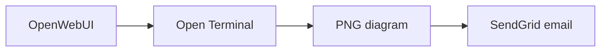

# OpenWebUI SendGrid Notifier

An OpenWebUI workspace tool that lets an LLM send an email notification to the
current user. The destination is locked to the email address in the authenticated
OpenWebUI user profile. It is not exposed as a tool argument or valve.

## Features

- Uses OpenWebUI's injected `__user__["email"]` as the only recipient
- Keeps the SendGrid API key in an admin-configured password valve
- Sends multipart plain-text and styled HTML email through SendGrid API v3
- Converts Markdown headings, emphasis, lists, links, code blocks, and tables
- Sanitizes generated HTML with a conservative tag and URL allowlist
- Renders up to three Mermaid code blocks as inline PNG images through Open Terminal
- Optionally attaches one file from the Open Terminal selected for the chat
- Reuses OpenWebUI's system-level Open Terminal URL, credentials, and access grants
- Enforces a 10 MB attachment limit without passing file bytes through the LLM
- Shows in-chat progress and error notifications
- Suppresses repeated sends from the same OpenWebUI message for 24 hours
- Limits each user to one successful notification every 10 minutes by default
- Uses only Python's standard library for HTTP requests
- Masks the destination address in the tool result

## Install

1. In OpenWebUI, open **Workspace → Tools → Create Tool**.
2. Copy the complete contents of `openwebui_sendgrid_notifier.py` into the editor.
3. Save the tool.
4. Open the tool's **Valves** settings and configure:
   - `SENDGRID_API_KEY`: a SendGrid key with **Mail Send** permission
   - `SENDER_EMAIL`: a sender address verified in SendGrid
   - `SENDER_NAME`: the display name recipients will see
   - `RATE_LIMIT_MINUTES`: minimum delay per user; defaults to `10` and can be
     set to `0` to disable the cooldown
5. Enable the tool for the desired model or select it in a chat.

No additional Open Terminal valves are required. Configure Open Terminal once in
**Admin Settings → Integrations → Open Terminal**. When an attachment is
requested, the tool uses the terminal selected for the current chat and reads its
connection from OpenWebUI's own `terminal_server.connections` configuration.

The sender address is configurable because SendGrid requires a verified sender.
The recipient is deliberately not configurable.

## Suggested model instruction

Add this to the model's system prompt if you want conservative tool use:

> Use `send_email_notification` only when the user explicitly asks for an email
> notification. Briefly confirm the subject and notification content before calling
> it. The recipient is automatically the current user's OpenWebUI account email.
> Write the message in Markdown. Use concise tables where useful and fenced
> `mermaid` blocks when a diagram materially improves understanding.
> To attach a generated Open Terminal file, pass its absolute path as
> `attachment_path`. Never attach a file unless the user explicitly requests it.

## Tool arguments

| Argument | Description |
|---|---|
| `subject` | Email subject, maximum 200 characters |
| `message` | Markdown email body, maximum 50,000 characters |
| `attachment_path` | Optional absolute path to one file in the Open Terminal selected for the chat; maximum file size 10 MB |

There is intentionally no `to`, `recipient`, `cc`, or `bcc` argument.

## Open Terminal attachment flow

1. The model creates or modifies a file with Open Terminal.
2. The model calls `send_email_notification` with the file's absolute path.
3. The notifier reads the active `terminal_id` injected by OpenWebUI.
4. It loads that system-level connection from OpenWebUI, checks the current user's
   access grants, and sends the user's ID and chat session ID to Open Terminal.
5. It downloads the file directly from `/files/view`, Base64-encodes it outside the
   model context, and adds it to the SendGrid request.

This works with terminals configured by an administrator under OpenWebUI's
system-level integrations. A direct terminal configured only in an individual
user's browser settings cannot be used because its URL and credentials are not
available to server-side Workspace Tools.

## Markdown and Mermaid email rendering

The notifier sends the original Markdown first as `text/plain`, followed by a
sanitized and styled `text/html` alternative. Supported formatting includes
headings, bold, italic, strikethrough, lists, links, blockquotes, fenced code,
horizontal rules, and GitHub-style tables. Raw HTML is escaped, remote Markdown
images are omitted, and links are restricted to `http`, `https`, and `mailto`.

Fenced `mermaid` blocks are rendered automatically when a system-level Open
Terminal is selected for the chat:

````markdown

````

The notifier invokes Mermaid CLI in Open Terminal, downloads the generated PNG,
and embeds it using a SendGrid inline CID attachment. It uses an existing `mmdc`
binary when available; otherwise it runs the pinned
`@mermaid-js/mermaid-cli@11.16.0` package through `npx`. The first render can take
longer while npm and Chromium are cached, and Open Terminal must be allowed to
reach the npm registry for that fallback.

No new notifier valve or shared Docker volume is required. The standard Open
Terminal image includes Node.js; minimal images without Node.js need an existing
`mmdc` installation or will use the source-code fallback.

Mermaid safeguards:

- At most three rendered diagrams per email
- 90-second render timeout per diagram
- Mermaid strict security mode with HTML labels disabled
- Fixed neutral theme, white background, 900 px base width, and 2x scaling
- Maximum 1.5 MB per PNG and 3 MB across all inline diagrams
- Maximum dimensions of 4,000 × 8,000 pixels
- Automatic cleanup of source, configuration, and PNG files
- Graceful source-code fallback when a diagram cannot be rendered

## Delivery safeguards

- **Idempotency:** OpenWebUI's injected `__message_id__` identifies the active
  assistant turn. Once a notification for that message succeeds, repeat calls are
  suppressed for 24 hours, even if the model changes the subject or body.
- **Per-user rate limit:** only one successful delivery is allowed per user during
  `RATE_LIMIT_MINUTES`. The authenticated OpenWebUI user ID is used when available;
  otherwise the normalized account email is used.
- **Failures are retryable:** SendGrid failures do not consume the cooldown and do
  not mark the message as delivered.
- **Concurrency:** simultaneous calls for the same user are serialized by the
  safeguards, preventing two requests from passing the checks together.

Safeguard state is held in memory and shared by all tool instances in one Python
process. It resets when OpenWebUI restarts and is not shared between multiple
OpenWebUI workers or replicas. Use a shared persistent store if you require
cross-process or restart-safe enforcement.

## Test

```bash
python -m pip install -e '.[test]'
pytest -q
```

Tests mock the SendGrid endpoint and never send real email.

## Security notes

- OpenWebUI workspace tools execute inside the OpenWebUI server process. Review
  all tool code before installing it.
- Give the SendGrid key only **Mail Send** permission.
- Restrict tool availability if users should not be able to trigger notifications.
- Attachment access is limited to the Open Terminal selected for the chat and is
  checked against the same system connection access grants as OpenWebUI.
- Mermaid rendering runs a pinned CLI package inside the selected Open Terminal.
  It does not send diagram source to a third-party rendering service.
- The tool depends on OpenWebUI's current internal configuration API. Re-test
  attachments after major OpenWebUI upgrades.
- SendGrid may still enforce account, sender-verification, and rate limits.

## License

MIT
